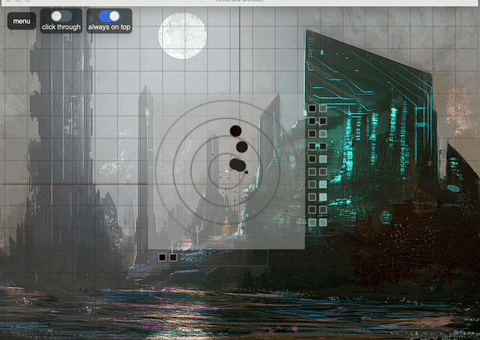
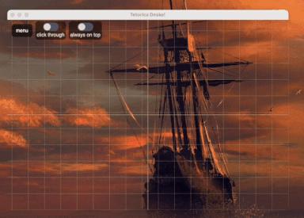

# tetorica deskel

Lightweight drawing overlay tool (デスケルアプリ)




---

## ✨ What is this?

**tetorica deskel** is a simple overlay tool for artists.

It displays grids and guides on top of your screen so you can:

* measure proportions
* align drawings
* trace references
* check balance and composition

Works with any app (Clip Studio, browser, PDF, etc.)

---

## Download

Prebuilt binaries are available on the GitHub Releases page.

👉 https://github.com/kyorohiro/tetorica-deskel/releases


## 🚀 Features

* Transparent overlay window
* Grid (adjustable spacing)
* Center cross
* Custom color / opacity / line width
* Click-through mode (interact with apps behind)
* Always-on-top toggle (pin)
* Global shortcut support
* rotate grid screen
* screenshot with grid

* measure stick


* color analysis


* simple draw


* chain measure stick



* TODO Calibration Screen Capture

* Multi Monitor   
tested obs and Indirect Display Driver (IDD) Sample (GitHub):
tested mac book air and usb c monitor

* Export Procreate Format and Png and CSV


---

## ⌨️ Shortcuts

| Action                     | Shortcut               |
| -------------------------- | ---------------------- |
| Toggle click-through       | `Cmd/Ctrl + Shift + J` |

---

## 🧠 Use Cases

* Drawing practice (デッサン)
* Manga / illustration layout
* Proportion checking
* Tracing reference images
* UI / design alignment

---

## 🎯 Concept

Most existing tools:

* require importing images
* modify the original image
* are not designed for real-time drawing

**tetorica deskel** is different:

👉 It does **nothing but overlay guides on your screen**

No saving
No editing
No friction

Just open and draw.

---

## ⚙️ Tech

* Tauri
* TypeScript
* Canvas API

---

## 📦 Build

```bash
npm install
npm run tauri dev
```

```bash
npm run tauri build
```


## 💡 Roadmap

* [ ] Image overlay (reference mode)
* [ ] PWA
* [ ] iOS/Android App
* [ ] Vector Search
* [ ] Save Copy&Past Color Pallet
* [ ] Calibration for ScreenCapture
* [ ] Contrast Analysis
* [ ] Support RYB base (now HSV)
---

## 📝 License

MIT

---


# ref

## toggle button

https://tailwindflex.com/@anonymous/toggle-me-animated-switch


## generated icon

https://www.design.com

## Demo Image

I used these artworks for the demo. Thank you!
Great artwork really enhances the visuals.

- https://walterlicinio.itch.io/artworks

- https://x.com/walterlicinio
