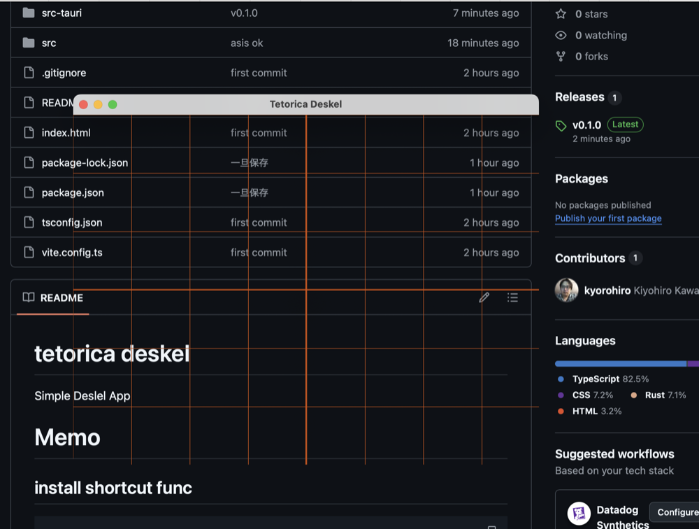

# tetorica deskel

Lightweight drawing overlay tool (デスケルアプリ)



---

## ✨ What is this?

**tetorica deskel** is a simple overlay tool for artists.

It displays grids and guides on top of your screen so you can:

* measure proportions
* align drawings
* trace references
* check balance and composition

Works with any app (Clip Studio, browser, PDF, etc.)

---

## Download

Prebuilt binaries are available on the GitHub Releases page.

👉 https://github.com/kyorohiro/tetorica-deskel/releases


## 🚀 Features

* Transparent overlay window
* Grid (adjustable spacing)
* Center cross
* Custom color / opacity / line width
* Click-through mode (interact with apps behind)
* Always-on-top toggle (pin)
* Global shortcut support

---

## ⌨️ Shortcuts

| Action                     | Shortcut               |
| -------------------------- | ---------------------- |
| Toggle click-through       | `Cmd/Ctrl + Shift + X` |
| Toggle pin (always on top) | `Cmd/Ctrl + Shift + P` |

---

## 🧠 Use Cases

* Drawing practice (デッサン)
* Manga / illustration layout
* Proportion checking
* Tracing reference images
* UI / design alignment

---

## 🎯 Concept

Most existing tools:

* require importing images
* modify the original image
* are not designed for real-time drawing

**tetorica deskel** is different:

👉 It does **nothing but overlay guides on your screen**

No saving
No editing
No friction

Just open and draw.

---

## ⚙️ Tech

* Tauri
* TypeScript
* Canvas API

---

## 📦 Build

```bash
npm install
npm run tauri dev
```

```bash
npm run tauri build
```

---

## ⚠️ macOS Notes

This app uses a transparent overlay window.

* Works fine for direct distribution (GitHub Releases)
* Not suitable for Mac App Store

---

## 💡 Roadmap

* [ ] Rule-of-thirds preset
* [ ] Diagonal guides
* [ ] Circle / ellipse guides
* [ ] Image overlay (reference mode)
* [ ] Measurement tools (distance / angle)
* [ ] Save & restore settings

---

## 📝 License

MIT

---

## 👀 Author

teto (tetorica)


# Memo

## install shortcut func

```
npm install @tauri-apps/plugin-global-shortcut
cd src-tauri
cargo add tauri-plugin-global-shortcut
```