# TETORICA DESKEL

Lightweight drawing overlay tool (デスケルアプリ)

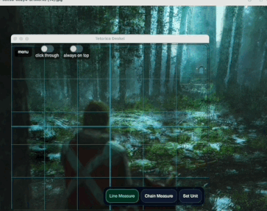

https://kyorohiro.github.io/tetorica-deskel/


---

## ✨ What is this?

Tetorica Deskel is a drawing overlay tool for PC and Web(limited functionality)..   
It runs on Windows and macOS. It works on top of other windows.   
It offers a design scale, measuring lines, color analysis, drawing guides, and palette creation.   
    
---

Japanese:    
Tetorica Deskel は PC向けのデスケルアプリです。Windows と Mac と Wec で動作します。他のウィンドウに重ねて利用できます。   
デザインスケール、はかり棒、色相分析、補助線、パレット作成などの機能を備えています。   
   
---

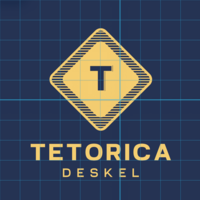

**tetorica deskel** is a simple overlay tool for artists.

It displays grids and guides on top of your screen so you can:

* measure proportions
* align drawings
* trace references
* check balance and composition

Works with any app (Clip Studio, browser, PDF, etc.)

---

## Download

Prebuilt binaries are available on the GitHub Releases page.

👉 https://github.com/kyorohiro/tetorica-deskel/releases


## 🚀 Features

* Transparent overlay window
* Grid (adjustable spacing)
* Center cross
* Custom color / opacity / line width
* Click-through mode (interact with apps behind)
* Always-on-top toggle (pin)
* Global shortcut support
* rotate grid screen
* screenshot with grid

* measure stick

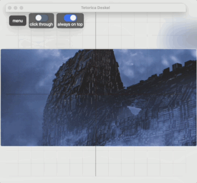

* color analysis

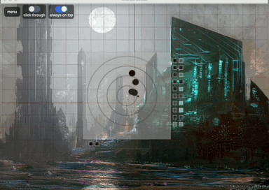

* simple draw

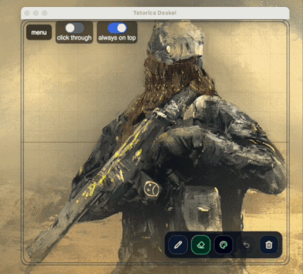

* chain measure stick


* TODO Calibration Screen Capture

* Multi Monitor   
tested obs and Indirect Display Driver (IDD) Sample (GitHub):
tested mac book air and usb c monitor

* Export Procreate Format and Png and CSV

* Contrast Analysis

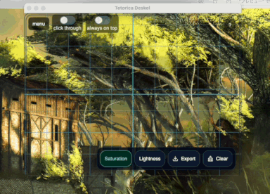

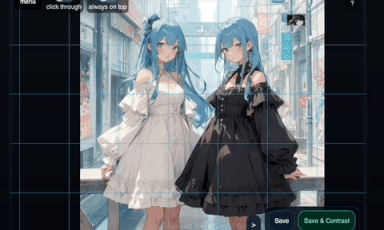

* Perspective correction ruler

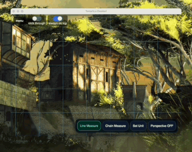

* Protan / Deutan / Tritan preview

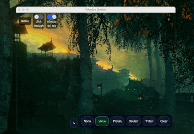

* For Web

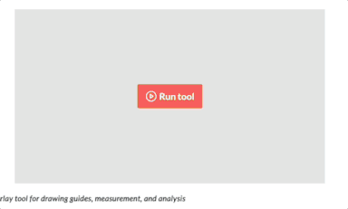

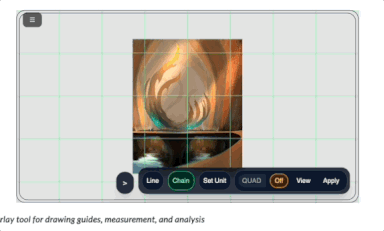


---

## ⌨️ Shortcuts

| Action                     | Shortcut               |
| -------------------------- | ---------------------- |
| Toggle click-through       | `Cmd/Ctrl + Shift + J` |

---

## 🧠 Use Cases

* Drawing practice (デッサン)
* Manga / illustration layout
* Proportion checking
* Tracing reference images
* UI / design alignment

---

## 🎯 Concept

Most existing tools:

* require importing images
* modify the original image
* are not designed for real-time drawing

**tetorica deskel** is different:

👉 It does **nothing but overlay guides on your screen**

No saving
No editing
No friction

Just open and draw.

---

## ⚙️ Tech

* Tauri
* TypeScript
* Canvas API

---

## 📦 Build

```bash
npm install
npm run tauri dev
```

```bash
npm run tauri build
```


## 💡 Roadmap

* [ ] Image overlay (reference mode)
* [ ] PWA
* [ ] iOS/Android App
* [ ] Vector Search
* [ ] Calibration for ScreenCapture
* [ ] Support RYB base (now HSV)
* [ ] Perspective correction ruler
---

## 📝 License

MIT

---


# ref

## toggle button

https://tailwindflex.com/@anonymous/toggle-me-animated-switch


## generated icon

https://www.design.com

## Demo Image

I used these artworks for the demo. Thank you!
Great artwork really enhances the visuals.

- https://walterlicinio.itch.io/artworks

- https://x.com/walterlicinio

- https://deviantart.com/al7al700/art/Japanese-Cc0-Girl-Anime-PNG-Free-Download-1144417787

- https://instagram.com/intpcommunity/


# itch.io pages

- https://kyorohiro.itch.io/tetorica-deskel


# Memo How to release 

https://itch.io/docs/itch/integrating/platforms/macos.html

## install butler
```
mkdir -p ~/bin
curl -L https://broth.itch.zone/butler/darwin-amd64/LATEST/archive/default -o /tmp/butler.zip
unzip -o /tmp/butler.zip -d /tmp/butler
chmod +x /tmp/butler/butler
mv /tmp/butler/butler ~/bin/butler
```

```
1) Spotlightで開く (⌘ + Space 押す)
2) キーチェーンアクセス → 証明書アシスタント → 認証局に証明書を要求
3) Apple Developer Console で Certification->Developer ID Application
4) security find-identity -v -p codesigning で 表示されれば成功

```

``` 
% sh deploy_mac.sh
% ~/bin/butler login
% ~/bin/butler push src-tauri/target/release/bundle/dmg/tetorica-deskel_0.14.7_aarch64.dmg kyorohiro/tetorica-deskel:mac-apple-silicon --userversion 0.14.7

% ~/bin/butler push src-tauri/target/x86_64-apple-darwin/release/bundle/dmg/tetorica-deskel_0.14.7_x64.dmg kyorohiro/tetorica-deskel:mac-intel --userversion 0.14.7

% ~/bin/butler push "src-tauri/target/release/bundle/nsis/tetorica-deskel_0.14.7_x64-setup.exe" kyorohiro/tetorica-deskel:windows --userversion 0.14.7
```

```
 ~/bin/butler push src-tauri/target/release/bundle/dmg/tetorica-deskel_0.14.7_aarch64.dmg kyorohiro/tetorica-deskel:mac-apple-silicon-prelease --userversion 0.14.7

% ~/bin/butler push src-tauri/target/x86_64-apple-darwin/release/bundle/dmg/tetorica-deskel_0.14.7_x64.dmg kyorohiro/tetorica-deskel:mac-intel-prelease --userversion 0.14.7

% ~/bin/butler push "tetorica-deskel_0.14.7_x64-setup.exe" kyorohiro/tetorica-deskel:windows-prelease --userversion 0.14.7
```


### For itch.io / web pag

```
npm run build:web
cd dist
zip -r ../web-build_0.14.7.zip .
```

### For github pages (pwa)

```
npm run build:gh
cd dist
zip -r ../web-build_0.14.7_gh.zip .
```